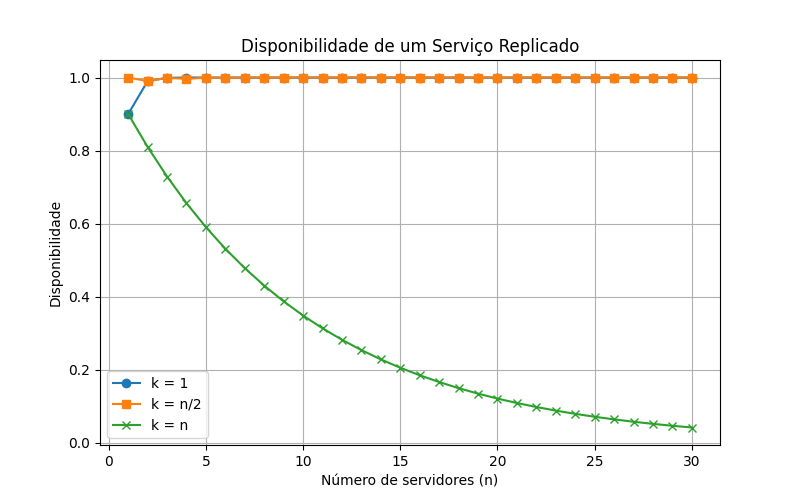

<<<<<<< HEAD
# Disponibilidade de Serviço Replicado

Trabalho da disciplina **Computação Distribuída**.

- Brenno Damiany - 2315088
- Caio Victor - 2010224
- Diego Queiroz - 2315108

O objetivo deste trabalho é analisar a **disponibilidade de um serviço replicado em múltiplos servidores** utilizando duas abordagens:

- Cálculo **analítico (teórico)**
- **Simulação estocástica**

---

# Exercício 1.1 — Dedução da fórmula

Considere:

- **n** = número total de servidores  
- **k** = número mínimo de servidores disponíveis para o serviço funcionar  
- **p** = probabilidade de cada servidor estar disponível  

O serviço estará disponível se **pelo menos k servidores estiverem ativos**.

A probabilidade de exatamente **i servidores estarem disponíveis** segue uma **distribuição binomial**.

A disponibilidade do serviço é dada por:

$$
A(n,k,p) = \sum_{i=k}^{n} \binom{n}{i} p^i (1-p)^{n-i}
$$

Onde:

- $\binom{n}{i}$ representa o número de combinações possíveis de **i servidores ativos entre n**.

---

# Casos extremos

## Caso 1 — Operação de consulta (k = 1)

O serviço funciona se **pelo menos um servidor estiver ativo**.

A probabilidade de todos os servidores estarem indisponíveis é:

$$
(1-p)^n
$$

Logo, a disponibilidade do serviço é:

$$
A = 1 - (1-p)^n
$$

---

## Caso 2 — Operação de atualização (k = n)

Nesse caso todos os servidores precisam estar disponíveis.

$$
A = p^n
$$

---

# Exercício 1.2 — Cálculo analítico

Foi implementado um algoritmo em **Python** para calcular a disponibilidade do serviço utilizando a fórmula analítica.

Foram analisados três cenários:

- **k = 1**
- **k = n/2**
- **k = n**

Com probabilidade de disponibilidade:

```
p = 0.9
```

Valores de servidores analisados:

```
n = 5, 10, 15
```

---

# Resultados

| n | k | p | Analítico | Simulação |
|---|---|---|---|---|
| 5 | 1 | 0.9 | 0.99990 | 1.0000 |
| 5 | 2 | 0.9 | 0.99954 | 0.9992 |
| 5 | 5 | 0.9 | 0.59049 | 0.5822 |
| 10 | 1 | 0.9 | 1.00000 | 1.0000 |
| 10 | 5 | 0.9 | 0.99985 | 1.0000 |
| 10 | 10 | 0.9 | 0.34868 | 0.3549 |

Os resultados da simulação são **muito próximos dos valores analíticos**, confirmando a validade da fórmula.

Pequenas diferenças ocorrem devido ao uso de **números aleatórios na simulação**.

---

# Simulação estocástica

Também foi implementado um simulador para validar os resultados.

Para cada rodada:

1. Cada servidor gera um número aleatório entre **0 e 1**.
2. Se o valor for **≤ p**, o servidor é considerado disponível.
3. Conta-se quantos servidores estão ativos.
4. Se **≥ k**, o serviço é considerado disponível.

A disponibilidade experimental é calculada como:

$$
Disponibilidade = \frac{rodadas\ bem\ sucedidas}{rodadas\ totais}
$$

---

# Gráfico

O gráfico abaixo mostra a comparação entre os valores **analíticos** e os obtidos por **simulação**.



---

# Conclusão

Os resultados mostram que:

- Quando **k é pequeno**, a disponibilidade do sistema é **muito alta**.
- Quando **k se aproxima de n**, a disponibilidade **diminui significativamente**.
- O modelo analítico baseado em **distribuição binomial** descreve corretamente o comportamento do sistema.
- A simulação estocástica confirma os resultados teóricos.

---

# Linguagem utilizada

Python

Bibliotecas utilizadas:

- `math`
- `random`
- `matplotlib`

---

# Estrutura do projeto

```
disponibilidade-servico/

README.md
simulacao.py

graficos/
    disponibilidade.png
```

